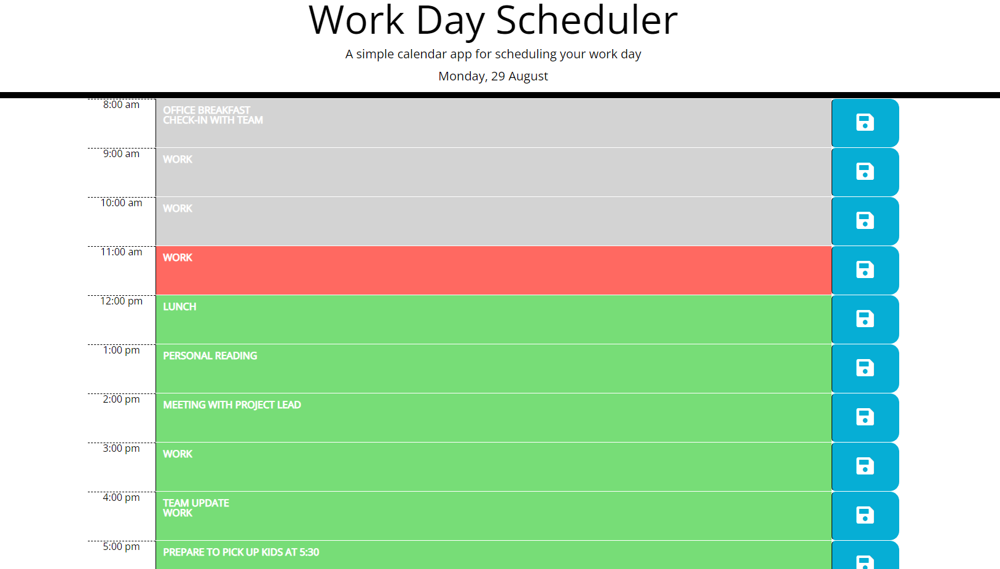

# Code Quiz

A weekday scheduler capable of saving daily tasks to local storage.

## Description

The scheduler will receive text into the text area and, upon pressing the save icon, push that to local storage for future retrieval. Each day will present the user with a clear list.

This was my first opportunity to build extensively with jQuery. Mixing strings and variables through the code allowed me to streamline much of the process into a few simple for-loops.

## Installation and Usage

Web application, hosted at: https://tomasdiaz83.github.io/WorkDayScheduler/

## Screenshots

The following images show the web application's appearance and functionality:

## Roadmap

The following features could be developed to better the scheduler's functionality:
- Ability to dynamically change date and see prior day's tasks
- User specify automatic "new day" so as to allow for evening before planning
- Ability to copy over prior day's tasks

## License

Copyright 2022 Tomas Diaz

Permission is hereby granted, free of charge, to any person obtaining a copy of this software and associated documentation files (the "Software"), to deal in the Software without restriction, including without limitation the rights to use, copy, modify, merge, publish, distribute, sublicense, and/or sell copies of the Software, and to permit persons to whom the Software is furnished to do so, subject to the following conditions:

The above copyright notice and this permission notice shall be included in all copies or substantial portions of the Software.

THE SOFTWARE IS PROVIDED "AS IS", WITHOUT WARRANTY OF ANY KIND, EXPRESS OR IMPLIED, INCLUDING BUT NOT LIMITED TO THE WARRANTIES OF MERCHANTABILITY, FITNESS FOR A PARTICULAR PURPOSE AND NONINFRINGEMENT. IN NO EVENT SHALL THE AUTHORS OR COPYRIGHT HOLDERS BE LIABLE FOR ANY CLAIM, DAMAGES OR OTHER LIABILITY, WHETHER IN AN ACTION OF CONTRACT, TORT OR OTHERWISE, ARISING FROM, OUT OF OR IN CONNECTION WITH THE SOFTWARE OR THE USE OR OTHER DEALINGS IN THE SOFTWARE.